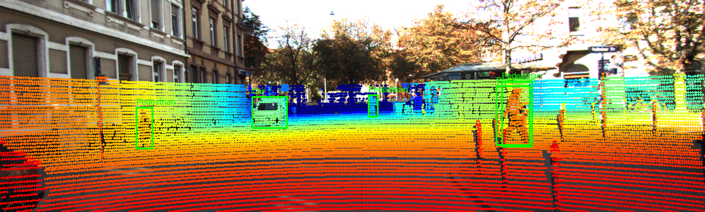
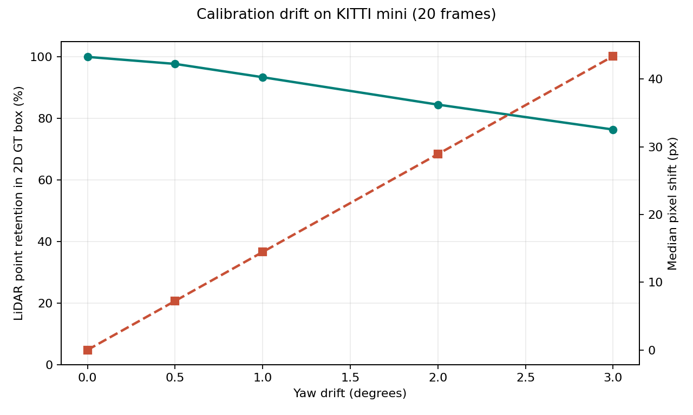
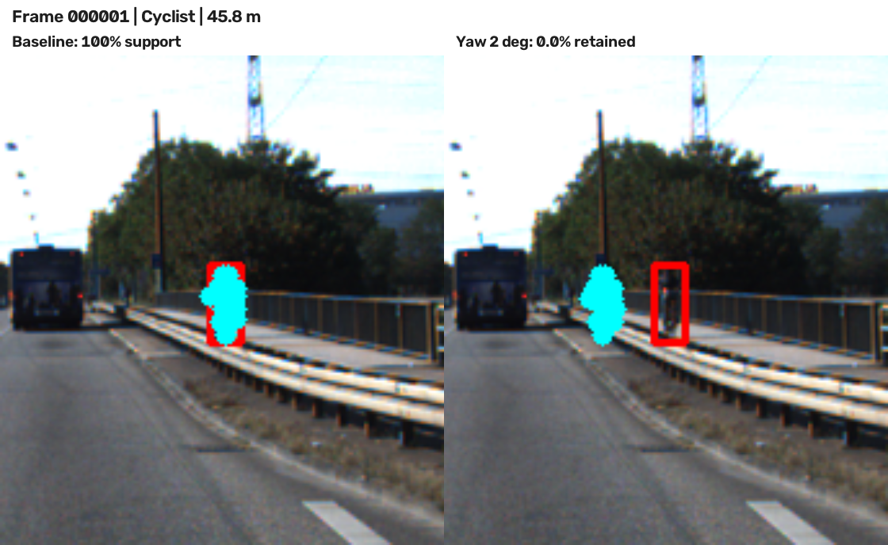

# Báo cáo Day 6: Độ nhạy của phép chiếu LiDAR-camera với yaw drift

- **Họ tên:** Tran Cao Quoc Dinh
- **MSSV:** 2A202602939
- **Lớp:** AI20K - Track 4
- **Link repo:** https://github.com/kentranpr4-crypto/TranCaoQuocDinh-2A202602939-Track4-Day21
- **Topic:** A - LiDAR-camera projection QA
- **Dataset:** `data/synthetic` để kiểm tra hình học; `data/kitti_mini` để đánh giá
- **Các frame đã dùng:** toàn bộ 20 frame KITTI mini; demo `000019`, `000011`, `000009`; failure `000001`; synthetic `000000`

## 1. Claim

Trên 20 frame KITTI mini, làm lệch yaw extrinsic LiDAR `2°` làm ít nhất `10%` điểm LiDAR hỗ trợ object rơi khỏi box 2D ground truth so với calibration gốc. Thí nghiệm dùng cùng 94 object (5–50 m) và cùng 35.363 điểm cho mọi mức yaw; chỉ thay đổi yaw. Claim nói về độ khớp projection, không phải độ chính xác của detector.

## 2. Evidence

Mỗi điểm được gán vào object bằng box 3D KITTI; chỉ giữ các điểm chiếu vào box 2D khi calibration gốc. Object cần ít nhất 5 điểm hỗ trợ. `retention_pct = 100 × số điểm vẫn trong box 2D / 35.363`; `visible_pct` dùng cùng mẫu số nhưng chỉ cần nằm trong ảnh. Median pixel shift tính trên điểm còn trong ảnh. Bảng đầy đủ: [`yaw_perturb_sweep.csv`](../results/yaw_perturb_sweep.csv); chi tiết từng object: [`per_object.csv`](../results/per_object.csv).

| Yaw drift | Trong FOV | Còn trong box 2D | Lệch pixel trung vị |
|---:|---:|---:|---:|
| 0° | 100,00% | 100,00% | 0,00 px |
| 0,5° | 99,51% | 97,72% | 7,23 px |
| 1° | 98,96% | 93,39% | 14,46 px |
| 2° | 97,76% | 84,49% | 28,91 px |
| 3° | 96,58% | 76,39% | 43,37 px |

Ở `2°`, mất `15,51%` điểm hỗ trợ nên claim được ủng hộ. FOV giảm chậm hơn retention: phần lớn điểm vẫn trong ảnh nhưng sai vị trí trên object. Ảnh demo gần (`000019`), trung bình (`000011`) và xa (`000009`) nằm trong `results/figures/`; dưới đây là ảnh `000011` và biểu đồ.

Dashboard tương tác: [`dashboard/index.html`](../dashboard/index.html). Demo chuyển động 15 trạng thái: [`GIF`](../results/figures/calibration_drift_demo.gif) hoặc [`MP4`](../results/figures/calibration_drift_demo.mp4).




## 3. Failure case

Frame `000001`, cyclist cách `45,84 m` có 18 điểm hỗ trợ. Khi yaw lệch `2°`, `0/18` điểm còn nằm trong box 2D; ảnh dưới chỉ hiện đúng 18 điểm này (màu cyan) và box ground truth (màu đỏ). Đây là failure lớp **Geometry**: extrinsic sai khiến điểm LiDAR của vật nhỏ, xa lệch khỏi vị trí trên ảnh. FOV đơn thuần khó phát hiện lỗi vì điểm vẫn có thể nằm trong khung hình. Khi vận hành, cần theo dõi alignment theo khoảng cách, cảnh báo khi score giảm và kiểm tra lại calibration. Nguồn ảnh: KITTI Vision Benchmark Suite.



## 4. Khuyến nghị nếu triển khai thật

Với ADAS dùng camera-LiDAR fusion, cần ghi log score alignment theo thời gian và theo khoảng cách, đặc biệt đối với vật nhỏ ở xa. Nếu score giảm kéo dài, cảnh báo calibration và giảm mức tin cậy vào fusion cho tới khi kiểm tra sensor. Đánh đổi: kiểm tra theo nhiều object tốn tính toán hơn metric FOV, nhưng FOV bỏ sót điểm lệch trong ảnh. Kết quả còn phụ thuộc box ground truth và tập KITTI nhỏ; cần kiểm tra thêm nhiều điều kiện thời tiết, sensor và nhãn trước khi chọn ngưỡng cảnh báo thực tế.

## 5. Cách chạy lại

Chạy từ thư mục gốc của repo bằng Python 3.10 trở lên. Script mặc định đọc 20 frame KITTI và tạo lại các file kết quả; thí nghiệm không dùng ngẫu nhiên.

```bash
python -m venv .venv
source .venv/bin/activate
pip install -r requirements.txt
python tools/verify_data.py --data-root data/kitti_mini
python -m unittest src.test_projection -v
python -m starter.projection --data-root data/synthetic --frame 000000
python -m src.topic_a
python -m src.build_demo
python tools/check_submission.py
```

Điểm synthetic `(10, 0, 0)` cho `z_cam = 9,727 m`, pixel `(613,964; 175,007)`; test cũng xác nhận lọc NaN, điểm sau camera và ngoài ảnh. Xem tham số bằng `python -m src.topic_a --help`.

## 6. Khai báo sử dụng AI

| Công cụ | Dùng cho việc gì | Đã kiểm chứng thế nào |
|---|---|---|
| OpenAI Codex | Hỗ trợ viết hai hàm projection, script benchmark, test và báo cáo | Chạy test synthetic và invalid-point; xác minh dữ liệu; chạy lại script để đối chiếu CSV; xem ảnh demo, biểu đồ, failure và so số trong báo cáo với CSV |

Mọi bảng số và ảnh trong báo cáo được tạo bằng code chạy trên dữ liệu trong repo. Người nộp cần tự đọc và giải thích được code cùng metric.
